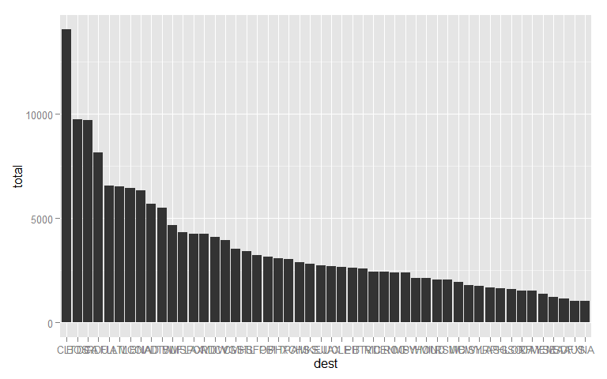
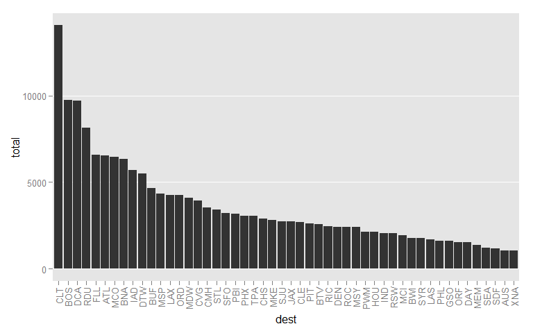

## Overview

`rsalad`, like any other salad, is a mixture of different healthy vegetables 
that you should be having frequently and that can make your life much better. 
Except that instead of vegetables, `rsalad` provides you with R functions.  

This package was born as a result of me constantly breaking the DRY principle
by copy-and-pasting functions from old projects into new ones.  Hence, the
functions in `rsalad` do not have a single common topic, but they are all 
either related to manipulating data.frames, improving ggplot2 plots, or general
productivity utilities.

## Analysis

This vignette will introduce all the families of functions available in
`rsalad`, but will not dive too deeply into any one specific function.  To
demonstrate all the functionality, we will use the `nycflights13::flights`
dataset (information about ~335k flights departing from NYC) to visualize the
50 most common destinations of flights out of NYC.  While the analysis is not 
particularly exciting, it will show how to use `rsalad` proficiently.

### Load packages

Before beginning any analysis using `rsalad`, the first step is to load the
package. It is strongly recommended to also have the `plyr` and `ggplot2`
packages installed, since they are used in many of the `rsalad` functions. 


```r
library(rsalad)
library(dplyr)
library(ggplot2)
```

### Load data

First step is to load the `flights` dataset and have a peak at how it looks


```r
fDat <- nycflights13::flights
head(fDat)
```


| year| month| day| dep_time| dep_delay| arr_time| arr_delay|carrier |tailnum | flight|origin |dest | air_time| distance| hour| minute|
|----:|-----:|---:|--------:|---------:|--------:|---------:|:-------|:-------|------:|:------|:----|--------:|--------:|----:|------:|
| 2013|     1|   1|      517|         2|      830|        11|UA      |N14228  |   1545|EWR    |IAH  |      227|     1400|    5|     17|
| 2013|     1|   1|      533|         4|      850|        20|UA      |N24211  |   1714|LGA    |IAH  |      227|     1416|    5|     33|
| 2013|     1|   1|      542|         2|      923|        33|AA      |N619AA  |   1141|JFK    |MIA  |      160|     1089|    5|     42|
| 2013|     1|   1|      544|        -1|     1004|       -18|B6      |N804JB  |    725|JFK    |BQN  |      183|     1576|    5|     44|
| 2013|     1|   1|      554|        -6|      812|       -25|DL      |N668DN  |    461|LGA    |ATL  |      116|      762|    5|     54|
| 2013|     1|   1|      554|        -4|      740|        12|UA      |N39463  |   1696|EWR    |ORD  |      150|      719|    5|     54|

### `%nin%` operator and `notIn()`

Let's say that for some reason we aren't interested in flights operated by
United Airlines (UA), Delta Airlines (DL) and American Airlines (AA). To choose
only carrier that are **not** part of that group, we can use the `%nin%`
operator, which is also aliased to `notIn()`.


```r
fDat2 <- fDat %>% filter(carrier %nin% c("UA", "DL", "AA"))
allCarriers <- fDat %>% dplyr::select(carrier) %>% first %>% unique
myCarriers <- fDat2 %>% dplyr::select(carrier) %>% first %>% unique

paste0("All carriers: ", paste(allCarriers, collapse = ", "))
paste0("My carriers: ", paste(myCarriers, collapse = ", "))
```

```
#> [1] "All carriers: UA, AA, B6, DL, EV, MQ, US, WN, VX, FL, AS, 9E, F9, HA, YV, OO"
#> [1] "My carriers: B6, EV, MQ, US, WN, VX, FL, AS, 9E, F9, HA, YV, OO"
```

The `%nin%` operator is simply the negation of `%in%`, but can be a handy
shortcut. `lhs %nin% rhs` is equivalent to `notIn(lhs, rhs)`.  The following
code would have the same result as above:


```r
fDat2_2 <- fDat %>% filter(notIn(carrier, c("UA", "DL", "AA")))
identical(fDat2, fDat2_2)
```

```
#> [1] TRUE
```

For more information, see `?rsalad::notIn`.

### `move` functions: move columns to front/back

The `move` family of functions can be used to rearrange the column order of a
data.frame by moving specific columns to be the first (`moveFront()` and
`moveFront_()`) or last (`moveBack()` and `moveBack_()`) columns.  
The order in which the columns are passed in as arguments determines the order
in which the columns will be in the resulting data.frame, regardless of whether
the columns are moved to the front or back.  

These functions support non-standard evaulation (see function documentation
for more details).

For brevity, we will only keep a few columns in the data.


```r
fDat3 <- fDat2 %>% dplyr::select(carrier, flight, origin, dest)
head(fDat3)
```


|carrier | flight|origin |dest |
|:-------|------:|:------|:----|
|B6      |    725|JFK    |BQN  |
|B6      |    507|EWR    |FLL  |
|EV      |   5708|LGA    |IAD  |
|B6      |     79|JFK    |MCO  |
|B6      |     49|JFK    |PBI  |
|B6      |     71|JFK    |TPA  |

Now let's rearrange the columns to be in this order: dest, origin, carrier, 
flight.


```r
fDat4 <- fDat3 %>% moveFront(dest, origin)
head(fDat4)
```


|dest |origin |carrier | flight|
|:----|:------|:-------|------:|
|BQN  |JFK    |B6      |    725|
|FLL  |EWR    |B6      |    507|
|IAD  |LGA    |EV      |   5708|
|MCO  |JFK    |B6      |     79|
|PBI  |JFK    |B6      |     49|
|TPA  |JFK    |B6      |     71|

The same result can be achieved in different ways using other `move` functions.

```r
fDat4_2 <- fDat3 %>% moveFront_(c("dest", "origin"))
fDat4_3 <- fDat3 %>% moveBack(carrier, flight) %>% moveFront(dest)

all(identical(fDat4, fDat4_2), identical(fDat4, fDat4_3))
```

```
#> [1] TRUE
```

For more information, see `?rsalad::move`.

### `dfFactorize()`: convert data.frame columns to factors

Sometimes you want to convert all the character columns of a data.frame
into factors.  In our current data, we have three character variables
(dest, origin, carrier), but they all make more sense as factors.  Rather
than converting each column manually, we can use the `dfFactorize()` function.  


```r
str(fDat4)
```

```
#> Classes 'tbl_df', 'tbl' and 'data.frame':	197272 obs. of  4 variables:
#>  $ dest   : chr  "BQN" "FLL" "IAD" "MCO" ...
#>  $ origin : chr  "JFK" "EWR" "LGA" "JFK" ...
#>  $ carrier: chr  "B6" "B6" "EV" "B6" ...
#>  $ flight : int  725 507 5708 79 49 71 1806 371 4650 343 ...
```

```r
fDat5 <- fDat4 %>% dfFactorize()
str(fDat5)
```

```
#> Classes 'tbl_df', 'tbl' and 'data.frame':	197272 obs. of  4 variables:
#>  $ dest   : Factor w/ 94 levels "ABQ","ACK","ALB",..: 12 32 38 48 63 90 11 32 4 63 ...
#>  $ origin : Factor w/ 3 levels "EWR","JFK","LGA": 2 1 3 2 2 2 2 3 3 1 ...
#>  $ carrier: Factor w/ 13 levels "9E","AS","B6",..: 3 3 4 3 3 3 3 3 8 3 ...
#>  $ flight : int  725 507 5708 79 49 71 1806 371 4650 343 ...
```

As you can see, calling `dfFactorize()` with no additional arguments converted
all potential factor columns into factors. Note that the integer column was
unaffected.  

By default, all character columns are coerced to factors, but we can also
specify which columns to convert or which columns to leave unaffected.


```r
str(fDat4 %>% dfFactorize(only = "origin"))
```

```
#> Classes 'tbl_df', 'tbl' and 'data.frame':	197272 obs. of  4 variables:
#>  $ dest   : chr  "BQN" "FLL" "IAD" "MCO" ...
#>  $ origin : Factor w/ 3 levels "EWR","JFK","LGA": 2 1 3 2 2 2 2 3 3 1 ...
#>  $ carrier: chr  "B6" "B6" "EV" "B6" ...
#>  $ flight : int  725 507 5708 79 49 71 1806 371 4650 343 ...
```

```r
str(fDat4 %>% dfFactorize(ignore = c("origin", "dest")))
```

```
#> Classes 'tbl_df', 'tbl' and 'data.frame':	197272 obs. of  4 variables:
#>  $ dest   : chr  "BQN" "FLL" "IAD" "MCO" ...
#>  $ origin : chr  "JFK" "EWR" "LGA" "JFK" ...
#>  $ carrier: Factor w/ 13 levels "9E","AS","B6",..: 3 3 4 3 3 3 3 3 8 3 ...
#>  $ flight : int  725 507 5708 79 49 71 1806 371 4650 343 ...
```

For more information, see `?rsalad::dfFactorize`.

### `dfCount()`: count number of rows per group

Our goal is to see which destinations were the most common, so the next step
is to count how many observations we have for each destination.  This can be
achieved using the base R function `table()`:


```r
head(table(fDat5$dest))
```

```
#> 
#>  ABQ  ACK  ALB  ATL  AUS  AVL 
#>  254  265  439 6541 1047  275
```

However, this is such a common task for me that I was not happy with the result
`table()` gives.  
Specifically:  

- `table()` returns a `table` object rather than the much more uesful
`data.frame`.  
- `table()` does not sort the resulting counts.  
- `table()` performs very slowly on large datasets, especially if the data is
numeric (see Performance section below).  

The `dfCount()` function provides an alternative way to count the data in a
data.frame column in an efficient way, sorts the results, and returns a
data.frame.  
Let's use dfCount to count the number of flights for each destination.


```r
countDat <- fDat5 %>% dfCount("dest")
head(countDat)
```


|dest | total|
|:----|-----:|
|CLT  | 14062|
|BOS  |  9739|
|DCA  |  9701|
|RDU  |  8162|
|FLL  |  6563|
|ATL  |  6541|

Now our count data is in a nice data.frame format that can play nicely with
other data.frames, and can be easily merged/joined into the original dataset
if we wanted to.

Since we only want to see the 50 most common destinations, and the count data
is sorted in descending order, we can now easily retain only the 50 destinations
that appeared the most.


```r
countDat2 <- slice(countDat, 1:50)
```

For more information, see `?rsalad::dfCount`.

### `plotCount()`: plot count data

The final step after obtaining the data we want is to visualize it effectively.

The `plotCount()` function is a convenient way to plot count data.  It is meant
to be called with the output of `dfCount()`, but any data.frame with a similar
structure (two columns; first column are distinct values; second column is
integer counts) will work.  

This is similar to how `barplot()` can be used to visualize the results of
`table()`. Since `dfCount()` is meant as a replacement for `table()`,
`plotCount()` can also accept the output from a `table()` call, though it is 
strongly recommended to use `dfCount()`.  

Note that `ggplot2` is the graphics package used to generate these plots.


```r
plotCount(countDat2)
```

 

For more information, see `?rsalad::plotCount`.

### `ggplotLayers` functions: useful ggplot2 layers

`rsalad` provides a few functions that add useful layers to `ggplot2` plots.
The plot above is too cluttered, and there are two specific functions we can
use to make it a little better.

`rotateTextX()` causes the labels on the x axis to be rotated so that they are
vertical, which is often useful when there are many overlapping labels along
the x axis, as we have here.


```r
plotCount(countDat2) + rotateTextX()
```

 

`removeGrid()` is used to always remove all the minor gridlines, and optinally 
also the major x/y gridlines (both by default).  In our case, I would like to
strip the minor y gridlines along with the major x gridlins, so I can use either
`removeGrid(x = TRUE, y = FALSE)` or, equivalently, `removeGridX()`.


```r
plotCount(countDat2) + rotateTextX() + removeGridX()
```

 

This figure looks much better!

Notice how these functions can be added to a ggplot2 plot object just like any
other native ggplot2 layer.

For more information, see `?rsalad::ggplotLayers`.

## Other functions

#### `spinMyR()`: create markdown/HTML reports from R scripts with no hassle
`spinMyR()` is an improvement on `knitr::spin` that adds flexibility in several
ways. `spin` is great and easy when all you need to do is convert an R script to
markdown/HTML and everything lives in the same directory.  But if you've ever
tried using `spin` on an R script and got confused about working directories or
tried changing the output location, you will love `spinMyR`.  Since `spin`
assumes that the working directory is the directory where the script is, all the
paths in the script must change if you are running the script manually or using
spin.  

I have battled with `spin` for too many hours, and the result is `spinMyR`.
`spinMyR` makes it easy to use spin on R scripts that require a certain working
directory that is not the script's directory, while allowing the script to still
function on its own.  `spinMyR` also lets you select where to output the
results, and adds several more features.

`spinMyR` can come in very handy when writing a script that can be used to
analyze a certain type of data, and you want to be able to easily run the script
on different datasets.  

For example, assume we have an R script that reads a data file and produced a
short report while also generating a figure. Native `spin` works great on simple
directory structures like these:

```
- project
  |- subproject
     |- input.csv
     |- script.R
```

The resulting directory structure after spinning would be

```
- project
  |- subproject
     |- markdown-figs
        |- fig1.png
     |- input.csv
     |- script.R
     |- script.Rmd
     |- script.md
     |- script.HTML
```

But here is a more realistic initial directory tree:

```
- project
  |- subproject
     |- data
        |- input.csv
     |- R
        |- script.R 
```

Now if we want `knitr::spin` to work, the path to the input would have to be
relative to the `R` directory. But if our working directory is `project`, then
the path to the input needs to be relative to `project`.  This means that
we can't use the exact same code to source the file vs `spin`-ing the file. 
A similar problem happens if you want to create files from the script.  And
another problem arises if you want to put the resulting md/HTML in a different
directory - that is not possible with simple `spin` (as far as I know).  

`spinMyR` fixes all these issues, and more. Assuming we are currently in the 
`project` directory, we could use the following command to generate an
appropriate tree structure:

```
spinMyR(file = file.path("R", "script.R"), wd = "subproject",
        outDir = "reports", figDir = "myfigs")

- project
  |- subproject
     |- data
        |- input.csv
     |- R
        |- script.R 
     |- reports
        |- myfigs
           |- fig1.png
        |- script.Rmd
        |- script.md
        |- script.HTML
```

One particular case when this kind of directory structure makes sense is when
you have many different datasets and want to store them separately from the
scripts or from the output.  You can imagine having "input-dean.csv" and
"input-john.csv" as two different datasets, with corresponding output in
"reports/dean/" and "reports/john/".

For more information, see `?rsalad::spinMyR`.

#### `tolowerfirst()`: convert first character to lower case

`rsalad` provides another function that can sometimes become handy.
`tolowerfirst()` can be used to convert the first letter of a string (or a 
vector of strings) into lower case. This can be useful, for example, when 
columns of a data.frame do not follow a consistent capitalization and you would 
like to lower-case all first letters.


```r
df <- data.frame(StudentName = character(0), ExamGrade = numeric(0))
(colnames(df) <- tolowerfirst(colnames(df)))
```

```
#> [1] "studentName" "examGrade"
```

For more information, see `?rsalad::tolowerfirst`.

#### `setdiffsym()`: symmetric set difference

When wanting to know the difference between two sets, the base R function
`setdiff()` unfortunately does not do exactly what you want because it is
*asymmetric*.  This means that the results depend on the order of the two
vectors passed in, which is often not the desired behaviour.  `setdiffsym`
implements symmetric set difference, whiich is a more intuitive set difference.


```r
setdiff(1:5, 2:4)
```

```
#> [1] 1 5
```

```r
setdiff(2:4, 1:5)
```

```
#> integer(0)
```

```r
setdiffsym(1:5, 2:4)
```

```
#> [1] 1 5
```

```r
setdiffsym(2:4, 1:5)
```

```
#> [1] 1 5
```

For more information, see `?rsalad::setdiffsym`.


## Performance of `dfCount()`

After some basic testing (not extremely thorough), I believe that `dfCount()`
performs much faster than its equivalent `table()` on large datasets, especially
when the data is numeric.  The analysis was done with the `microbenchmark`
package to compare the two functions on a few different datasets.


```r
library(microbenchmark)

# Prepare all the datasets to test on
fDat <- nycflights13::flights
largeIntDat <- data.frame(col = rep(1:25, 100000))
largeCharDat <- data.frame(col = rep(letters[1:25], 100000))
smallDat <- data.frame(col = rep(1:25, 100))

# Run the benchmarking
m <- 
	microbenchmark(
	  dfCount(fDat, "day"), table(fDat$day),
	  dfCount(fDat, "dest"), table(fDat$dest),
	  dfCount(largeIntDat, "col"), table(largeIntDat$col),
	  dfCount(largeCharDat, "col"), table(largeCharDat$col), 
	  dfCount(smallDat, "col"), table(smallDat$col),
	  times = 10
	)
```


|expr                         |        min|       mean|     median|        max| neval|
|:----------------------------|----------:|----------:|----------:|----------:|-----:|
|dfCount(fDat, "day")         |  15649.839|  16039.499|  16034.332|  16401.963|    10|
|table(fDat$day)              | 108979.644| 111106.119| 109989.258| 119228.992|    10|
|dfCount(fDat, "dest")        |  18465.542|  18781.712|  18730.911|  19206.670|    10|
|table(fDat$dest)             |  23964.262|  26921.593|  26003.466|  30131.171|    10|
|dfCount(largeIntDat, "col")  | 101819.798| 106519.771| 106332.179| 111141.819|    10|
|table(largeIntDat$col)       | 838499.915| 889727.634| 892542.567| 957909.607|    10|
|dfCount(largeCharDat, "col") | 102527.205| 106424.949| 104159.742| 119269.677|    10|
|table(largeCharDat$col)      | 186889.426| 212388.542| 195742.469| 258933.588|    10|
|dfCount(smallDat, "col")     |   2103.897|   2308.898|   2313.370|   2524.310|    10|
|table(smallDat$col)          |    990.005|   1077.130|   1076.506|   1183.534|    10|

Every pair of rows corresponds to counting the same data using `dfCount()` vs
`table()`.  The results show that:  

- `dfCount()` was faster in all 4 large datasets  
- `dfCount()` was an order of magnitude faster in both cases when the data
was numeric  
- `dfCount()` was slower on very the small dataset


After performing this analysis, I've realized that the likely cause of the
speed boost is due to `dfCount()` relying on `dplyr`. After making that
realization, I found that `dplyr` also has a `count()` function, which
performs equally fast as `dfCount()`, which further supports the hypothesis
that the speed boost was thanks to `dplyr`. However, I still want to include
this function in the package because it took a lot of hard work (and
documentation!), and it also has a very differences from `dplyr::count()`. For 
example, `dplyr::count()` does not sort by default, which I find to be
the less desired behaviour, and `dplyr::count()` does not have a
standard-evaluation version.
